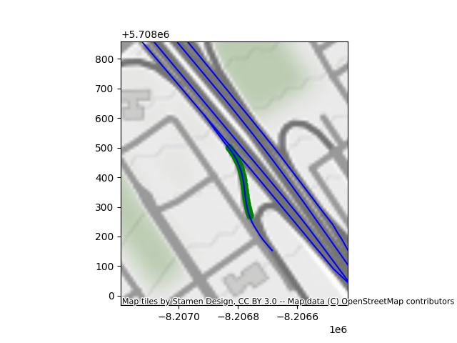

# Documentation du jeu de données de conduite
IVI Solution présente un jeu de données de conduite sur des routes Québécoises. Ce jeu de données est composé de vidéos de conduite, de données de capteurs internes du véhicules ainsi que des données GPS.
Ces données ont été récupérées sur des routes Québécoises par une flotte de véhicules du Ministère du Transport du Québec.
Cet ensemble de données répertorie X points de passages sur les routes, chacun avec un minimum de Y vidéos. 

# Visualisation des données

Visualisation des données à l'aide de [foxglove](https://foxglove.dev)


<iframe
src="https://foxglove.ivisolutions.ca:12455/?ds=remote-file&ds.url=https%3A%2F%2Fpacman-foxglove-demo.s3.amazonaws.com%2Fdemo.mcap&time=2023-01-25T13%3A57%3A18.319968734Z"
width='100%' height='700' title="foxglove data viz demo">
</iframe>


# Guide sur l'installation
Un échantillon de deux positions est disponible dans "database_presentation".
Un plus gros échantillon de 20 positions est disponible au téléchargement sur:
__**insérer le lien ici**__


## Toutes les données sur une carte
Chaque point sur la carte correspond à un dossier "location" dans le jeu de données disponible au téléchargement.


## visualisation
Voici 4 gifs présentant le même tronçon de route prit des jours différents. 

|![][gif1] | ![][gif2] |
|----------|-----------|
|![][gif3] | ![][gif4] |


[gif1]:./images_readme/position_trigger_02_09_2023-21_44_29_h264.gif
[gif2]:./images_readme/position_trigger_02_10_2023-08_48_34_h264.gif
[gif3]:./images_readme/position_trigger_02_11_2023-07_50_45_h264.gif
[gif4]:./images_readme/position_trigger_02_11_2023-12_21_48_h264.gif

Voici un gif synchronisé
![][gif5]

<!-- [gif5]:https://github.com/InstitutVehiculeInnovant/pacman-driving-dataset/blob/main/images_readme/loc2.png -->
[gif5]: ./images_readme/gifs/location2.gif

### Map
Voici une image de la carte correspondant aux videos ci-dessus.
Les points verts représentent les différentes positions du véhicule sur la durée de la vidéo.
Les lignes bleues sont les routes les plus proches des points verts retrouvées par l'algorithme.
Autrement dit, les routes sur lesquelles le véhicule se trouve probablement. 



# Description des données
## ROS - Robot Operating System
ROS est un ensemble de librairies et d'outils qui permettent de fabriquer une application de robotique. L'architecture ROS permet une communication simple entre différents éléments via la publication de messages vers des topics. 
Pour recevoir un message, un élément doit s'abonner à un topic. Pour envoyer, il suffit de *publier* dans ce topic.

Un **ROSbag** est un enregistrement des messages reçu par un ou plusieurs *topics*. 
La structure d'un message est semblable à celle d'un JSON, c'est à dire qu'il y a des objets qui possèdent des valeurs et des listes. 


<details>
<summary><b>Liste des topics enregistrés</b></summary>


`/camera_info`:   
Type: sensor_msgs/msg/CameraInfo  
Description: **A déterminer**
  
`/can/abs`:   
Type: std_msgs/msg/Bool  
Unité: booléen  
Description: True lorsque l'ABS du vehicule est active, pas de messages le reste du temps. Le topic peut rester vide sur un bag complet. 
 
`/can/accel_lat`:  
Type: std_msgs/msg/Float32  
Unité: m/s²  
Description: Accélération latérale du véhicule par rapport à son référentiel. 
<!-- Accélération latérale ressentie par les occupants du véhicule. Une valeur positive représente une accélération vers la droite, en général parce que le véhicule tourne vers la gauche.   
Une valeur négative est une accélération vers la gauche.   -->

`/can/accel_long`:  
Type: std_msgs/msg/Float32  
Unité: m/s²  
Description: Accélération longitudinale du véhicule par rapport à son référentiel.
<!-- Accélération longitudinale ressentie par les occupants du véhicule. Une valeur positive représente une accélération du véhicule, les occupants sont pressés contre leur siège, le véhicule accélère les occupants vers l'avant.  
Une valeur négative correspond à un freinage du véhicule et les occupants gardent leur inertie et peuvent être penché vers l'avant du véhicule.  -->

`/can/accel_pedal_pos`:  
Type: std_msgs/msg/Float32  
Unité: Pas d'unités, range [0,102.3]  
Description: Position de la pédale d'accélération.
 
`/can/accel_vert`:  
Type: std_msgs/msg/Float32   
Unité: m/s²  
Description: Accélération verticale.
 
`/can/brake_pressure`:  
Type: std_msgs/msg/UInt16  
Unité: Nm, range théorique [0,65535].
Description: Couple appliquée par la pédale de frein.
 
`/can/speed1`:  
Type: std_msgs/msg/Float32  
Unité: km/h   
Description: Vitesse du véhicule  
 
`/can/steer_col_tq`:   
Type: std_msgs/msg/Float32   
Unité: Nm, range [-8,8]  
Description: Couple appliquée au volant  

`/can/steering_angle`:  
Type: std_msgs/msg/Float32   
Unité (à déterminer): range [-4876.8,1676.7].   
Description: Position du volant. Negatif: tournant vers la droite. Positif: tournant vers la gauche  

`/can/traction`:  
Type: std_msgs/msg/Bool  
Unité: **A déterminer**    
Description: Activation du modele de traction control.  

`/can/wheel_fl_speed`:   
Type: std_msgs/msg/Float32  
Unité: rad/s  
Description: Vitesse de la roue avant gauche.  
  
`/can/wheel_fr_speed`:   
Type: std_msgs/msg/Float32  
Unité: rad/s  
Description: Vitesse de la roue avant droite.  
  
`/can/wheel_rl_speed`:   
Type: std_msgs/msg/Float32  
Unité: rad/s  
Description: Vitesse de la roue arrière gauche.  
  
`/can/wheel_rr_speed`:   
Type: std_msgs/msg/Float32  
Unité: rad/s  
Description: Vitesse de la roue arrière droite.  
  
`/fix`:   
Type: sensor_msgs/msg/NavSatFix  
Description: Position *GPS* du véhicule.   
  
`/fix_velocity`:   
Type: geometry_msgs/msg/TwistWithCovarianceStamped  
Unité: m/s  
Description: Vitesse du véhicule. Le repère est ENU (East, North, Up). 
  
`/heading`:   
Type: sensor_msgs/msg/Imu  
Description: Direction du véhicule. Repère ENU.
  
`/image_raw/compressed`:   
Type: sensor_msgs/msg/CompressedImage  
Format: JPEG  
Description: Image de la route  
  
</details>

## Structure des documents

Chaque dossier contient tous les bags associés à une position et "position_metadata.json" qui référence tous les bags avec leur date, et la prédiction de la météo.

    .
    ├── position1
    │   ├── position_trigger1.bag
    │   │   ├── metadata.yaml
    │   │   └── position_trigger1.bag_0.db3
    │   ├── position_trigger2.bag
    │   ├── ...
    │   └── position_metadata.json
    ├── position2
    └── ...

Les "metadata.yaml" sont déjà présents dans la base de données et contiennent les infos relatives à chaque bag.

*Strucutre d'**position_metadata.json**:*
```json
{
  "location": {
    "longitude": -73.72278046025653,
    "latitude": 45.54911467352514
  },
  "n_bags": 10,
  "road_type": "exit",
  "bags": [
    {
      "name": "position_trigger_02_09_2023-21_44_29.bag",
      "date": "2023-02-10 02:44:29.399899+00:00", // format ISO 8601
      "weathercode": 61,
      "meteo": "Slight Rain",
    },
    {}
  ],
}
```

## Meteo 
Chaque image contient "weathercode" et "meteo", ces deux informations sont redondantes. "weathercode" est le code de la météo donné par l'API (Open-Meteo) et "meteo" est la signification du code.
**Note**: Si la météo n 'est pas disponible via l'API, le "weathercode" sera -1.
**Note**: La prédiction de la météo peut être fausse et ne pas correspondre exactement à la météo que l'on peut voir sur une image mais elle donne une bonne indication.

<details>
  <summary><b>Codes de météo</b></summary>

| Weathercode | Meteo | Traduction française |
| --- | --- | --- |
| 0 | Clear Sky | Ciel dégagé |
| 1 | Mainly Clear | Principalement dégagé |
| 2 | Partly Cloudy | Partiellement nuageux |
| 3 | Overcast | Couvert |
| 45 | Fog | Brouillard |
| 48 | Depositing Rime Fog | Brouillard givrant |
| 51 | Light Drizzle | Légère bruine |
| 53 | Moderate Drizzle | Bruine modérée |
| 55 | Dense Intensity Drizzle | Bruine forte |
| 56 | Light Freezing Drizzle | Légère bruine verglaçante |
| 57 | Dense Intensity Freezing Drizzle | Bruine verglaçante forte |
| 61 | Slight Rain | Pluie légère |
| 63 | Moderate Rain | Pluie modérée |
| 65 | Heavy intensity Rain | Pluie forte |
| 66 | Light Freezing Rain | Légère pluie verglaçante |
| 67 | Heavy Intensity Freezing Rain | Pluie verglaçante forte |
| 71 | Slight Snow fall | Légère chute de neige |
| 73 | Moderate Snow fall | Chute de neige modérée |
| 75 | Heavy Intensity Snow fall | Chute de neige forte |
| 77 | Snow Grains | Grains de neige |
| 80 | Slight Rain Showers | Légères averses de pluie |
| 81 | Moderate Rain Showers | Averses de pluie modérées |
| 82 | Violent Rain Showers | Averses de pluie violentes |
| 85 | Slight Snow Showers | Légères averses de neige |
| 86 | Heavy Snow Showers | Averses de neige fortes |
| 95 | Thunderstorm | Orage |
| 96 | Thunderstorm With Slight | Orage avec légère pluie |
| 99 | Thunderstorm With Heavy Hail | Orage avec fortes chutes de grêle |

</details>


# Génération des données
De nombreux véhicules du Ministère du Transport du Québec sont équipés de caméras, de GPS et d'IMU. En plus de ces capteurs, un connecteur récupère les informations du CAN Bus du véhicule afin d'avoir accès à des informations telles que la vitesse, l'accélération, la position du volant, etc.

Pour la création de ce jeu de données, 4 types de routes ont été choisies pour couvrir un maximum de situations possibles:
- Routes droites
- Routes courbes
- Intersections
- Entrées/sorties d'autoroutes

~200 points GPS sont placés sur chaque type de routes à travers le Québec, lorsqu'un véhicule passe par l'un de ces points, il enregistre un RosBag d'une dizaine de secondes.


<!-- ## Transformée entre les différentes repères  
Pour /fix 
commentaire de PM:
"Pas dans la description des topics mais il va falloir. Partagé la transformé entre les différents repère. Le /fix de donne la position de antenne GPS pas du référenciel de la voiture."

Pour /image_raw/compressed
"Pas dans la description des topics mais il va falloir. Partagé la transformé entre les différents repère. Le /fix de donne la position de antenne GPS pas du référenciel de la voiture." 
-->

