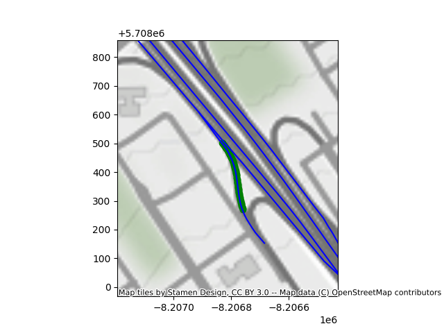

# Documentation du jeu de données de conduite

# Guide sur l'installation
Un échantillon des données est disponible dans "database_presentation"

## visualisation
Voici 4 gifs présentant le même tronçon de route prit des jours différents. 

|![][gif1] | ![][gif2] |
|----------|-----------|
|![][gif3] | ![][gif4] |

[gif1]:https://bitbucket.org/ivi-arion/pacman-driving-dataset/raw/78c21f5369ea9f096912821eb89094208acbbf0e/readme_images/position_trigger_02_09_2023-21_44_29_h264.gif
[gif2]:https://bitbucket.org/ivi-arion/pacman-driving-dataset/raw/78c21f5369ea9f096912821eb89094208acbbf0e/readme_images/position_trigger_02_10_2023-08_48_34_h264.gif
[gif3]:https://bitbucket.org/ivi-arion/pacman-driving-dataset/raw/78c21f5369ea9f096912821eb89094208acbbf0e/readme_images/position_trigger_02_11_2023-07_50_45_h264.gif
[gif4]:https://bitbucket.org/ivi-arion/pacman-driving-dataset/raw/78c21f5369ea9f096912821eb89094208acbbf0e/readme_images/position_trigger_02_11_2023-12_21_48_h264.gif


### Map
Voici une image de la carte correspondant aux videos ci-dessus.
Les points verts représentent les différentes positions du véhicule sur la durée de la vidéo.
Les lignes bleues sont les routes les plus proches des points verts retrouvées par l'algorithme.
Autrement dit, les routes sur lesquelles le véhicule se trouve probablement. 



# Description des données
## ROS - Robot Operating System
ROS est un ensemble de librairies et d'outils qui permettent de fabriquer une application de robotique. L'architecture ROS permet une communication simple entre différents éléments via la publication de messages vers des topics. 
Pour recevoir un message, un élément doit *s'abonner* à /écouter un topic. Pour envoyer, il suffit de *publier* à cette adresse.

Un **ROSbag** est un enregistrement des messages reçu par un ou plusieurs *topics*. 
La structure d'un message est semblable à celle d'un JSON, c'est à dire qu'il y a des objts qui possèdent des valeurs et des listes. 

## Liste des topics enregistrés

`/camera_info`:   
Type: sensor_msgs/msg/CameraInfo  
Description: **A completer** Probablement la calibration de la camera?  
  
`/can/abs`:   
Type: std_msgs/msg/Bool  
Unité: booléen  
Description: True lorsque l'ABS du vehicule est active, pas de messages le reste du temps. Le topic peut rester vide sur un bag complet. 
 
`/can/accel_lat`:  
Type: std_msgs/msg/Float32  
Unité: m/s²  
Description: Accélération latérale ressentie par les occupants du véhicule. Une valeur positive représente une accélération vers la droite, en général parce que le véhicule tourne vers la gauche.   
Une valeur négative est une accélération vers la gauche.  

`/can/accel_long`:  
Type: std_msgs/msg/Float32  
Unité: m/s²  
Description: Accélération longitudinale ressentie par les occupants du véhicule. Une valeur positive représente une accélération du véhicule, les occupants sont pressés contre leur siège, le véhicule accélère les occupants vers l'avant.  
Une valeur négative correspond à un freinage du véhicule et les occupants gardent leur inertie et peuvent être penché vers l'avant du véhicule. 
 
`/can/accel_pedal_pos`:  
Type: std_msgs/msg/Float32  
Unité: Pas d'unités, range [0,102.3]  
Description: Accélération de la pédale conducteur transmise au véhicule. En cas de cruise control, la valeur correspond à celle donnée  par le cruise control.   
 
`/can/accel_vert`:  
Type: std_msgs/msg/Float32   
Unité: m/s²  
Description: Acceleration verticale. Dans la majorité des cas, elle correspond simplement à l'accélération gravitationnelle.    
 
`/can/brake_pressure`:  
Type: std_msgs/msg/UInt16  
Unité: Nm, range théorique [0,65535]. Les données n'ont pas présenté pas de valeurs supérieures à 2000Nm.
Description: Force appliquée par la pédale de frein.
 
`/can/speed1`:  
Type: std_msgs/msg/Float32  
Unité: km/h   
Description: Vitesse du véhicule  
 
`/can/steer_col_tq`:   
Type: std_msgs/msg/Float32   
Unité: Nm, range [-8,8]  
Description: Force appliquée au volant  

`/can/steering_angle`:  
Type: std_msgs/msg/Float32   
Unité (à déterminer): range [-4876.8,1676.7]. 
Description: Position du volant. Negatif: tournant vers la droite. Positif: tournant vers la gauche  
<!-- 
`/can/traction`:  **Donnees?**  
Type: std_msgs/msg/Bool  
Unité:   
Description:    -->

`/can/wheel_fl_speed`:   
Type: std_msgs/msg/Float32  
Unité: rad/s  
Description: Vitesse de la roue avant gauche.  
  
`/can/wheel_fr_speed`:   
Type: std_msgs/msg/Float32  
Unité: rad/s  
Description: Vitesse de la roue avant droite.  
  
`/can/wheel_rl_speed`:   
Type: std_msgs/msg/Float32  
Unité: rad/s  
Description: Vitesse de la roue arrière gauche.  
  
`/can/wheel_rr_speed`:   
Type: std_msgs/msg/Float32  
Unité: rad/s  
Description: Vitesse de la roue arrière droite.  
  
`/fix`:   
Type: sensor_msgs/msg/NavSatFix  
Description: Position *GPS* du véhicule.   
  
`/fix_velocity`:   
Type: geometry_msgs/msg/TwistWithCovarianceStamped  
Unité: m/s  
Description: Vitesse du véhicule. Le repère est ENU (East, North, Up), X correspond à la vitesse latérale tandis que Y la vitesse longitudinale.  
  
`/heading`:   
Type: sensor_msgs/msg/Imu  
Description: Direction du véhicule. Format Quaternion (w,x,y,z). Pour obtenir une orientation en °:  
`heading = -atan2(2*(w*z + x*y), 1-2*(y**2 + z**2)) * 180 / PI`  
Orientation par rapport aux points cardinaux:  
Est: 0°  
Nord: 90°  
Sud: -90°  
Ouest: +-180°  
  
`/image_raw/compressed`:   
Type: sensor_msgs/msg/CompressedImage  
Format: JPEG  
Description: Image de la route  
  
  
`/parameter_events`:   
Type: rcl_interfaces/msg/ParameterEvent  
Unité:   
Description: Présent par défaut dans un rosbag   
  
`/rosout`:   
Type: rcl_interfaces/msg/Log  
Unité: NA  
Description: Logs, présent par défaut dans un rosbag  
  

## Structure des documents

Quatres dossiers séparent le type de route. Ensuite chaque sous-dossier contient tous les bags associés à une position.
Un YAML global référence tous les bags avec leur date, et la météo. (copie en json pour avoir un avis du MTQ sur leurs préférences)

    .
    ├── position1
    │   ├── position_trigger1.bag
    │   │   ├── metadata.yaml
    │   │   └── position_trigger1.bag_0.db3
    │   ├── position_trigger2.bag
    │   ├── ...
    │   ├── informations.json
    │   └── informations.yaml
    ├── position2
    └── ...

Les "metadata.yaml" sont déjà présents dans la base de données et contiennent les infos relatives à chaque bag.

*Strucutre d'informations.yaml:*
```yaml
- position:
  nom_folder: "position1"
  localisation : (-73,45)
  nombre_de_bags: 17
  bags:
    - bag:
      name: "nomDuBag.bag"
      weathercode: 75
      meteo:  soleil
      timestamp: 2022_01_27-10h00 (format exemple)
      type: Intersection
      essui-glace: true
      abs: false
    - bag:
      ...
- position:
    ...
```

**Ajouter ABS et essui-glace dans le code**

Si la meteo n'est pas disponible dans la base de données (pour n'importe quelle raison), la valeur sera -1

Les directions ne sont pas séparées, ainsi on pourra trouver facilement toutes les manières de prendre une même intersection.


## Génération des données
De nombreux véhicules du Ministère du Transport du Québec sont équipés de caméras, de GPS et d'IMU. En plus de ces capteurs, un connecteur récupère les informations du CAN Bus du véhicule afin d'avoir accès à des informations telles que la vitesse, l'accélération, la position du volant, etc.

Pour la création de ce jeu de données, 4 types de routes ont été choisies pour couvrir un maximum de situations possibles:
- Routes droites
- Routes courbes
- Intersections
- Entrées/sorties d'autoroutes

~200 points GPS sont placés sur chaque type de routes à travers le Québec, lorsqu'un véhicule passe par l'un de ces points, il enregistre un RosBag d'une dizaine de secondes.

